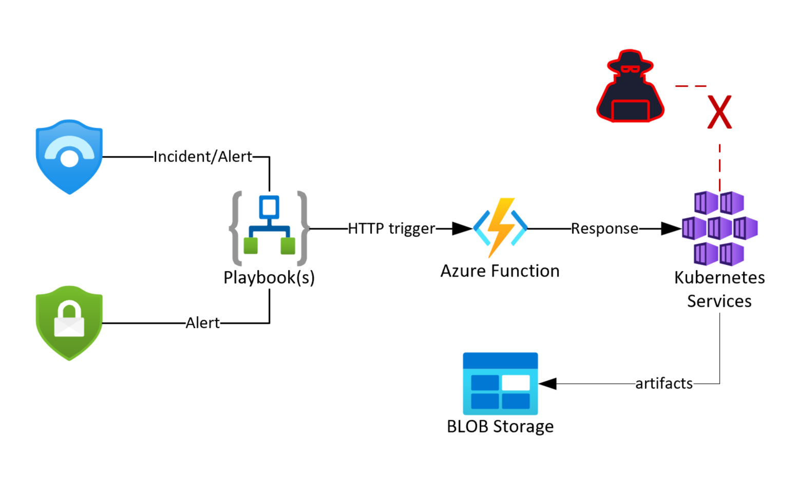

#### Last update: May 2022

# DFIR for Kubernetes: leverage Azure SOAR capabilities to respond to Kubernetes security incidents


***In this article, I am describing and sharing a solution which allow incident responders to perform incident response on a target Kubernetes cluster, in Microsoft Sentinel, in a response to an alert raised by Microsoft Defender for Cloud or from Defender for Cloud directly.***

<p style="width: 100%; text-align: center;">

<p></p>
</p>
 
> As discussed in my [previous article](http://guillaumeben.xyz/defender-containers.html) on Defender for Containers, the skyrocketting usage of Kubernetes and containarized workloads over the past years has led to new attack vectors. We can expect these attacks to grow in number and sophistications in the future, and be also (more) leveraged by nation-state actors and in advanced persistent threats.<br /> 
> One of the recurring issue for Security Operations teams is to be able not only to monitor critical Kubernetes environment in their respective organizations, have the ability, knowledge and tools to be able to detect a security incident on Kubernetes, but also respond adequately or collect evidence.
> Incident Response on Kubernetes can range fron artifacts collection and labelling to pod or namespace isolation. 
> I am describing in this article a solution to automate incident response on AKS, from Defender for Cloud or Microsoft Sentinel. 
> The solution will work natively with alerts raised by Defender for Containers, but can be adapted for your own alerts and detection capabilities in Azure.
 <p></p>

## Description of the solution

The solution's goal is to perform automated reponse on alerts raised by Defender for Containers and leverages the following assets:
* An Azure Function written in Python
* A set of logic apps (playbooks) for each supported response 
* A BLOB storage to upload collected artifacts (Optional)

### Authentication and security

The Azure Function leverages an [Azure Managed Identity](https://docs.microsoft.com/en-us/azure/active-directory/managed-identities-azure-resources/overview) to issue command and response actions to the targeted AKS cluster. This allows to avoid using or managing static credentials. <br />
The function also allows to upload targeted artifacts to a pre-existing BLOB storage, relying on SAS token which can be short-lived. <br />
The function and the logic apps should all enforce TLS 1.2.<br />
<br />
Malicious access to the function could lead to a full compromise of your AKS cluster. Managed identity should thus be controlled carefully.

### List of supported responses

The solution currently allows for analysts to trigger the following responses, as playbook:
- Label and isolate a specific pod on targeted cluster
- Label and isolate a complete namespace on targeted cluster
- Label and cordon a AKS node on targeted cluster
- Collect pod artifacts and upload them to a BLOB storage on targeted cluster
- Run a command on a pod on targeted cluster

All operations can be reverted (uncordon, remove isolation...)

## Installation

### Azure Function

The Azure Function is used to issue commands to the AKS cluster. It makes the bridge between Sentinel and the AKS cluster. 
The code for the Azure Function can be found [here](https://github.com/tuxnam/Azure-AKS-Incident-Response/tree/main/AKSResponseFunction/AKSTriggerResponse).
<br />
Language: Python 3.8<br />
Authentication: application key<br />
Trigger: HTTP<br />

The function needs to be created in a App Service Plan of your choice, and the python code of the above repository, used in a HTTP trigger function. 
The name given will then need to be used as a parameter of the playbooks. 

### Playbooks 

---
#### Collect Artifacts Playbook 

**Specification:**<br />
This playbook allows to collect the following artifcats from a pod entity contained in a Defender for Container alert from Sentinel:
- Pod logs (kubectl logs <pod>)
- Pod full description (kubectl get <pod> -o json)
- Pod description (kubectl describe <pod>)

**Required Parameters:**<br />
 
- Playbook Name: name you want to give to this playbook
- Username: username for the connection of the playbook to Sentinel 
- Storage Account: storage account name used to collect artifacts
- BLOB Container Name: BLOB container name inside the storage account
- SAS Token URI: the SAS token to be used to upload to the BLOB storage (make sure it is short-lived)
- AKS Response Function name: the name of the related AKS response function part of this solution
- AKS Response Functio code: the access key used to authenticate and call the Azure Function
 
**Expected Entities in Sentinel Alert:** <br />

 The minimum list of entities required in the JSON body of the alert is the following (can contain more entities, which will just be ignored):
 
 ```
  [
    {
      "ResourceId": "/subscriptions/6178a2ae-xxxx-xxxx-xxxx-xxx95af392b9/resourceGroups/k8s-demo-rg/providers/Microsoft.ContainerService/managedClusters/my-super-cluster",
      "Type": "azure-resource"
    },
    {
      "Name": "damn-vuln-cluster",
      "Type": "K8s-cluster"
    },
    {
      "Name": "default",
      "Type": "K8s-namespace"
    },
    {
      "Name": "health-check-deployment-7d78966d57-gjk49",
      "Type": "K8s-pod"
    }
  ]
 ```
 
**Deploy Artifcats Collection playbook:** <br />
 
[](https://raw.githubusercontent.com/tuxnam/Azure-AKS-Incident-Response/main/LogicApps/AKS-Resp-CollectArtifacts/azuredeploy.json?token=GHSAT0AAAAAABOR6J3GM4WRI7H65LZZRHEAYTYZSHA)

---

#### Isolate Pod (and remove isolation)

**Specification:**<br />
This playbook allows to isolate a pod on a node using Kubernetes Network Policy (therefore a hard requirement is a network driver such as Calico or Azure network policy). The following policy will be created, blocking all ingress and egress flows for the targeted pod:

```
            apiVersion: networking.k8s.io/v1
            kind: NetworkPolicy
            metadata:
                name: deny-all-affected
            spec:
                podSelector:
                    matchLabels:
                        status: quarantine
                policyTypes:
                    - Egress
                    - Ingress
```

The playbook also adds a label ```status=quarantine``` to the target pod. 
The pod selected is the pod present as part of the list of entities of a Defender for Container alert.
 
The playbook 'remove isolation', removes both the network policy and the label.

**Required Parameters:**<br />
 
- Playbook Name: name you want to give to this playbook
- Username: username for the connection of the playbook to Sentinel 
- AKS Response Function name: the name of the related AKS response function part of this solution
- AKS Response Functio code: the access key used to authenticate and call the Azure Function
 
**Expected Entities in Sentinel Alert:** <br />
 
  The minimum list of entities required in the JSON body of the alert is the following (can contain more entities, which will just be ignored):
 
 ```
  [
    {
      "ResourceId": "/subscriptions/6178a2ae-xxxx-xxxx-xxxx-xxx95af392b9/resourceGroups/k8s-demo-rg/providers/Microsoft.ContainerService/managedClusters/my-super-cluster",
      "Type": "azure-resource"
    },
    {
      "Name": "damn-vuln-cluster",
      "Type": "K8s-cluster"
    },
    {
      "Name": "mysuperAKSpool",
      "Type": "K8s-pod"
    },
    {
      "Name": "namespace-name",
      "Type": "K8s-namespace"
    }
  ]
 ```
 
**Deploy Isolate Pod playbook:** <br />
 
[](https://raw.githubusercontent.com/tuxnam/Azure-AKS-Incident-Response/main/LogicApps/AKS-Resp-IsolatePod/azuredeploy.json?token=GHSAT0AAAAAABOR6J3H23ONQVDEKRCYJNRMYUDXZMQ) 
 
**Deploy Remove Isolation Pod playbook:** <br />
 
[](https://raw.githubusercontent.com/tuxnam/Azure-AKS-Incident-Response/main/LogicApps/AKS-Resp-RemovePodIsolation/azuredeploy.json?token=GHSAT0AAAAAABOR6J3GEL3DYQDMWLAE666SYUESXIA)

---
 
#### Isolate Namespace (and remove isolation)
 

**Specification:**<br />
This playbook allows to isolate a complete namespace using Kubernetes Network Policy (therefore a hard requirement is a network driver such as Calico or Azure network policy). The following policy will be created, blocking all ingress and egress flows for the targeted namespace:

```
            apiVersion: networking.k8s.io/v1
            kind: NetworkPolicy
            metadata:
                name: deny-all-affected
            spec:
                podSelector:
                    matchLabels:
                        status: quarantine
                policyTypes:
                    - Egress
                    - Ingress
```

The playbook also adds a label ```status=quarantine``` to the target namespace. 
The namespace selected is the namespace present as part of the list of entities of a Defender for Container alert.
 
The 'remove isolation namespace' playbook deletes the network policy and removes the label associated. 

**Required Parameters:**<br />
 
- Playbook Name: name you want to give to this playbook
- Username: username for the connection of the playbook to Sentinel 
- AKS Response Function name: the name of the related AKS response function part of this solution
- AKS Response Functio code: the access key used to authenticate and call the Azure Function
 
**Expected Entities in Sentinel Alert:** <br />
 
  The minimum list of entities required in the JSON body of the alert is the following (can contain more entities, which will just be ignored):
 
 ```
  [
    {
      "ResourceId": "/subscriptions/6178a2ae-xxxx-xxxx-xxxx-xxx95af392b9/resourceGroups/k8s-demo-rg/providers/Microsoft.ContainerService/managedClusters/my-super-cluster",
      "Type": "azure-resource"
    },
    {
      "Name": "damn-vuln-cluster",
      "Type": "K8s-cluster"
    },
    {
      "Name": "namespace-name",
      "Type": "K8s-namespace"
    }
  ]
 ```
 
**Deploy Isolate Namespace playbook:** <br />
 
[](https://raw.githubusercontent.com/tuxnam/Azure-AKS-Incident-Response/main/LogicApps/AKS-Resp-IsolatePod/azuredeploy.json?token=GHSAT0AAAAAABOR6J3H23ONQVDEKRCYJNRMYUDXZMQ](https://raw.githubusercontent.com/tuxnam/Azure-AKS-Incident-Response/main/LogicApps/AKS-Resp-IsolateNamespace/azuredeploy.json?token=GHSAT0AAAAAABOR6J3HX7BV2CBGM5U3FVPEYUESNVAP)

**Deploy Remove Isolation Namespace playbook:** <br />
 
[(https://raw.githubusercontent.com/tuxnam/Azure-AKS-Incident-Response/main/LogicApps/AKS-Resp-RemoveNamespaceIsolation/azuredeploy.json?token=GHSAT0AAAAAABOR6J3GLKYC22W546MPWTWMYUESZEA)
 
---

#### Cordon Node (and remove cordon)

**Specification:**<br />
This playbook allows to cordon a node in a Kubernetes cluster, targetting a node entity contained in a Defender for Container alert from Sentinel.
A node cordon means preventing Kubernetes to schedule pods on this node. This means as well that it can allow to avoid new pods being populated on a compromised node.

The 'remove cordon' playbook, allows pods to be scheduled again to the node. 
 
**Required Parameters:**<br />
 
- Playbook Name: name you want to give to this playbook
- Username: username for the connection of the playbook to Sentinel 
- AKS Response Function name: the name of the related AKS response function part of this solution
- AKS Response Functio code: the access key used to authenticate and call the Azure Function
 
**Expected Entities in Sentinel Alert:** <br />
 
  The minimum list of entities required in the JSON body of the alert is the following (can contain more entities, which will just be ignored):
 
 ```
  [
    {
      "ResourceId": "/subscriptions/6178a2ae-xxxx-xxxx-xxxx-xxx95af392b9/resourceGroups/k8s-demo-rg/providers/Microsoft.ContainerService/managedClusters/my-super-cluster",
      "Type": "azure-resource"
    },
    {
      "Name": "damn-vuln-cluster",
      "Type": "K8s-cluster"
    },
    {
      "Name": "mysuperAKSpool",
      "Type": "K8s-node"
    }
  ]
 ```
 
**Deploy Cordon Node playbook:** <br />
 
[](https://raw.githubusercontent.com/tuxnam/Azure-AKS-Incident-Response/main/LogicApps/AKS-Resp-CordonNode/azuredeploy.json?token=GHSAT0AAAAAABOR6J3H2UY7R56LF2244GYMYT2YGDQ) 

**Deploy Cordon Node playbook:** <br />
 
[](https://raw.githubusercontent.com/tuxnam/Azure-AKS-Incident-Response/main/LogicApps/AKS-Resp-UncordonNode/azuredeploy.json?token=GHSAT0AAAAAABOR6J3HQ7AVYJFTEFSGFKJIYUES2TA)

 ---
 
#### Run Command

**Specification:**<br />
This playbook allows to run a command on a pod in a Kubernetes cluster, targetting a the pod entity contained in a Defender for Container alert from Sentinel.
Be mindful of the critical impact of running commands in a production pod or this logic app being misused to run malicious commands.

**Required Parameters:**<br />
 
- Playbook Name: name you want to give to this playbook
- Username: username for the connection of the playbook to Sentinel 
- AKS Response Function name: the name of the related AKS response function part of this solution
- AKS Response Functio code: the access key used to authenticate and call the Azure Function
- Command: command to be executed on the pod 
 
**Expected Entities in Sentinel Alert:** <br />
  
The minimum list of entities required in the JSON body of the alert is the following (can contain more entities, which will just be ignored):
 
 ```
  [
    {
      "ResourceId": "/subscriptions/6178a2ae-xxxx-xxxx-xxxx-xxx95af392b9/resourceGroups/k8s-demo-rg/providers/Microsoft.ContainerService/managedClusters/my-super-cluster",
      "Type": "azure-resource"
    },
    {
      "Name": "damn-vuln-cluster",
      "Type": "K8s-cluster"
    },
    {
      "Name": "default",
      "Type": "K8s-namespace"
    },
    {
      "Name": "health-check-deployment-7d78966d57-gjk49",
      "Type": "K8s-pod"
    }
  ]
 ```
 
**Deploy Run Command playbook:** <br />
 
[](https://raw.githubusercontent.com/tuxnam/Azure-AKS-Incident-Response/main/LogicApps/AKS-Resp-RunCommand/azuredeploy.json?token=GHSAT0AAAAAABOR6J3HDLKHYIJIOAHH4DTSYT6RMYA) 

---
 
### All the code used in this solution can be found here: https://github.com/tuxnam/Azure-AKS-Incident-Response.
